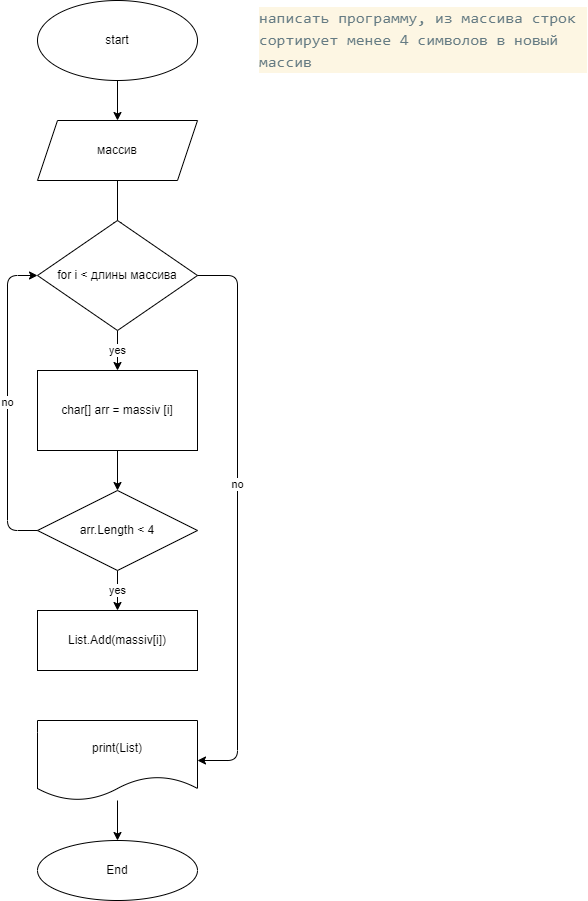

Написать програму, которая из имеющегося массива строк формирует массив из строк, длина которых меньше или равна 3 символа.
Первоначальный массив задан на старте выполнения алгоритма.
При решении лучше обойтись массивами.

P.S. воспользовалась Списками, для оптимальной записи из существующего массива, так же можно было сделать через новый массив с изменением размера Array.Resize(ref massiv, count);

